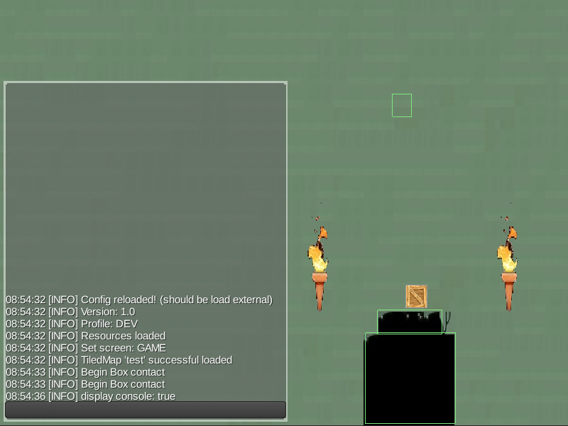

# GDXConsole
#### LibGDX console with _LibGDX_, _BOX2D_, _BOX2DLight_, _VisUI_ And _Tiled Map_

## Description

GDXConsole

Console to simplify development of applications based on LibGDX

Perform many operations dynamically in runtime

For the opportunity to update config dynamically - external file loading should be used

AssetServiceImpl.EXTERNAL_APPLICATION_CONFIG = true

application.json --> assetConfig.externalFiles = true

## Features
- Dynamic resource loading
- Built-in console
- TiledMap support
- Visual UI
- Box2D and Box2DLight support
- Modular system - enable/disable each module
- Profile management
- Running commands from file (scripting)

#### Console commands
- VER (VERSION) - version from application.json config
- INFO - send log message
- SCREEN <name> <effect> - set screen
  Effects: fade, fadein, circle
- ASSET
  - load - load resources from resources\resources.json
  - reset - asset reload
- CFG - config management
  - UPDATE - update application config
  - CONSOLE
    - show - show/hide console (F2 key) [true/false/0/1]
  - SCREEN
    - fps - show/hide FPS  [true/false/0/1]
    - heap - show/hide FPS [true/false/0/1]
  - MAP
    - rendering - rendering tiled map [true/false/0/1]
  - BOX2D
    - rendering - rendering box2d world [true/false/0/1]
    - sprite - box2d static sprite rendering [true/false/0/1]
    - anim - box2d animated sprite rendering [true/false/0/1]
    - debug - box2d debug rendering [true/false/0/1]
    - lights - box2d lights rendering [true/false/0/1]
  - AUDIO
    - music - enable/disable music [true/false/0/1]
    - sound  - enable/disable sound [true/false/0/1]
  - UPDATE - reload application config (EXTERNAL_APPLICATION_CONFIG should be true)
- CLR - clear console
- MUSIC
  - play <name>
  - playLoop <name>
  - stop <name>
  - stopAll
- SOUND
  - play <name>
  - stop <name>
  - stopAll <name>
- MAP
  - load <mapName> - loading tiled map
  - reload - reload active tiled map
  - clear - clear map
- CMD <profileName> - run commands from config/startup-<profileName>.json
- PROFILE - show active profile
- UI
  - load - load default UI
- APP
  - exit - exit program
